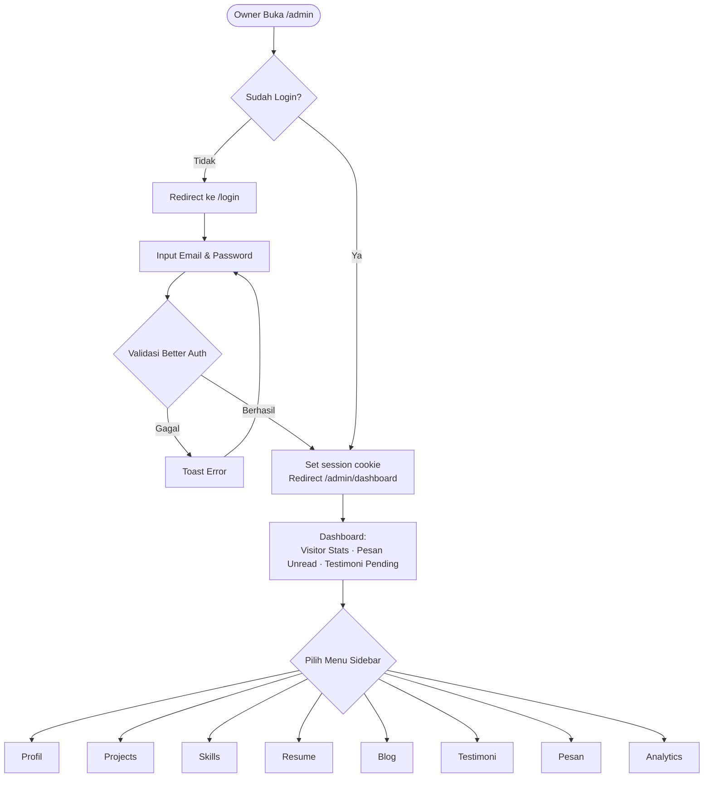
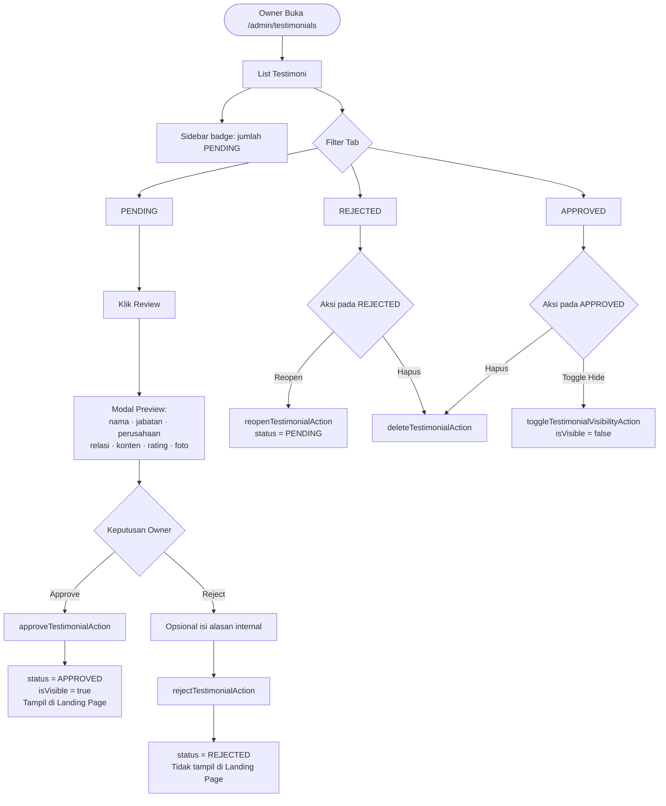
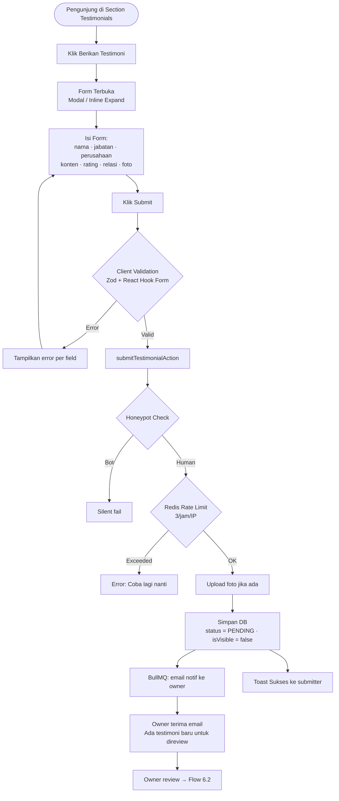
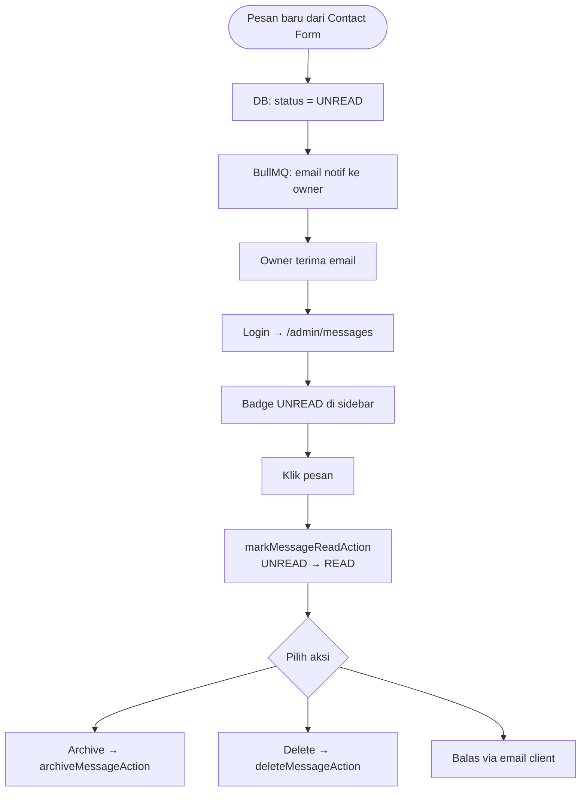
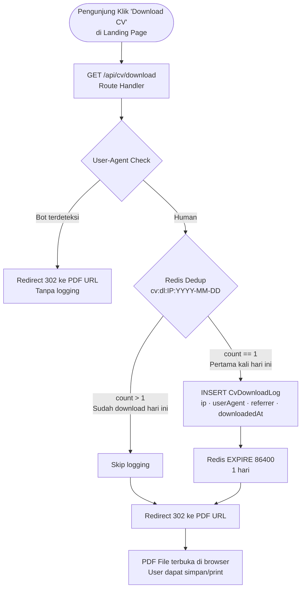
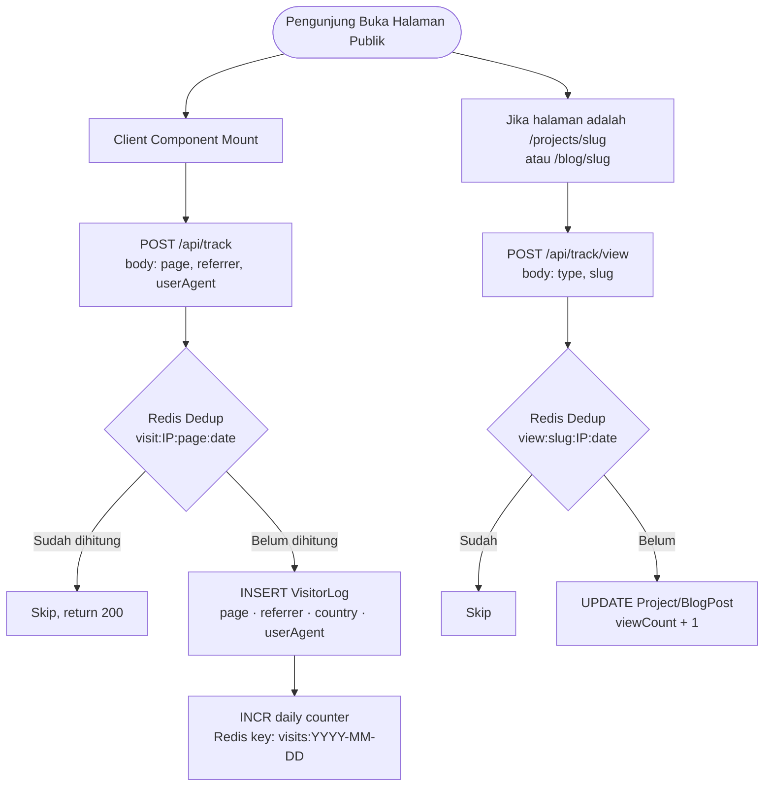
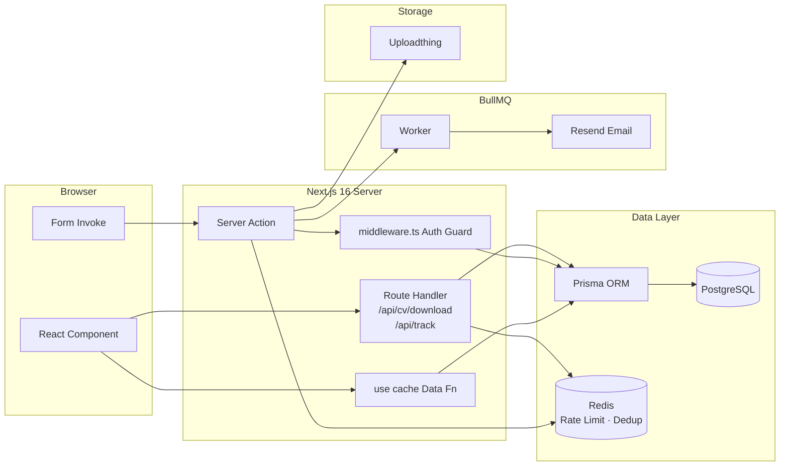
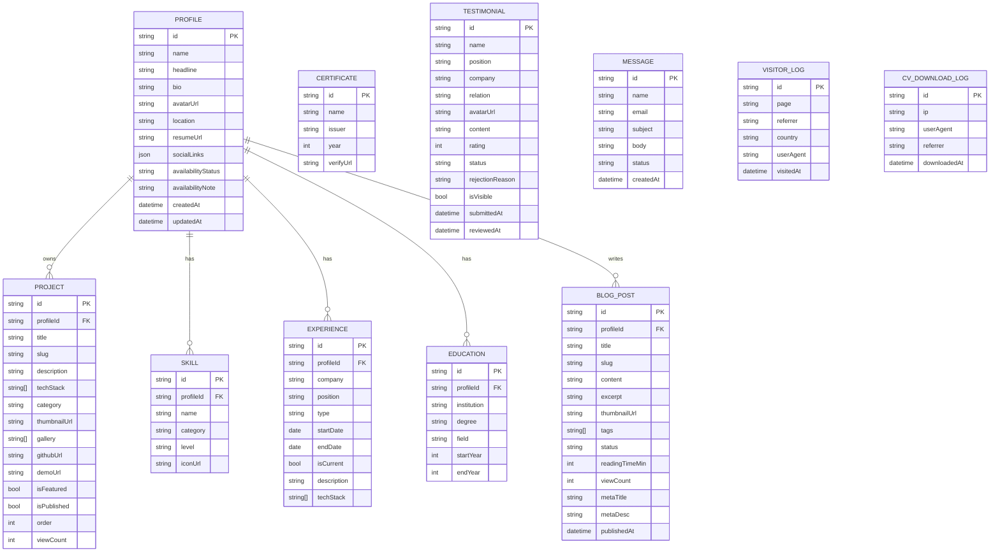

# 📋 Product Requirements Document (PRD)
## Personal Portfolio Website with CMS

---

> **Document Version:** 1.3.0
> **Status:** Final Draft
> **Author:** [Your Name]
> **Last Updated:** 2025
> **Changelog:**
> - `v1.0.0` — Initial draft
> - `v1.1.0` — Rename tabel `user` → `profile`; tambah public testimonial form + review flow
> - `v1.2.0` — Upgrade ke **Next.js 16**; async `params` & `cookies()` pattern; `use cache` directive; penyempurnaan testimonial review flow + Prisma schema
> - `v1.3.0` — **Final PRD**: Analytics dashboard charts (visitor trend, pesan masuk, CV download); CV download tracking real via Route Handler + Redis dedup; tambahan fitur: availability badge, project/blog view count, `/cv` print page, OG dynamic image, sitemap, dark mode, search palette
>
> **Tech Stack:** Next.js 16 (App Router), Server Actions, PostgreSQL, Prisma ORM, Better Auth, Redis, BullMQ, Tailwind CSS v4, Recharts

---

## 📌 Table of Contents

1. [Product Overview](#1-product-overview)
2. [Target Audience & User Persona](#2-target-audience--user-persona)
3. [User Stories](#3-user-stories)
4. [Functional Requirements](#4-functional-requirements)
5. [Non-Functional Requirements](#5-non-functional-requirements)
6. [User Flow](#6-user-flow)
7. [Architecture Overview](#7-architecture-overview)
8. [Success Metrics KPIs](#8-success-metrics-kpis)
9. [Out of Scope](#9-out-of-scope)
10. [Open Questions](#10-open-questions)
11. [Appendix](#appendix--design-reference)

> **Highlight v1.3.0:** Section [4.1.9 Analytics Dashboard](#419-analytics-dashboard--charts) sekarang mencakup spesifikasi chart lengkap dan mekanisme CV download tracking yang hanya menghitung unduhan nyata (manusia, 1× per IP per hari). Section [4.4 Additional Enhancements](#44-additional-enhancements--suggestions) berisi fitur-fitur yang direkomendasikan untuk meningkatkan kualitas portofolio.

---

## 1. Product Overview

### 1.1 Visi Produk

Membangun sebuah **Personal Portfolio Website** yang dilengkapi dengan **Content Management System (CMS) berbasis Admin Panel**, sehingga pemilik portofolio dapat memperbarui seluruh konten secara mandiri tanpa menyentuh kode, sekaligus memberikan pengalaman visual yang profesional dan berkesan bagi pengunjung publik (termasuk recruiter dan HR).

### 1.2 Problem Statement

| # | Masalah | Dampak |
|---|---------|--------|
| 1 | Pemilik portofolio harus mengedit langsung di kode untuk memperbarui konten | Lambat, error-prone, tidak scalable |
| 2 | Tidak ada sistem terpusat untuk mengelola project, skill, blog, dan testimoni | Konten tidak konsisten & sulit dimonitor |
| 3 | Tidak ada mekanisme untuk melacak siapa saja yang mengunjungi portofolio | Tidak ada data untuk evaluasi performa |
| 4 | Pesan dari form "Contact Me" tidak terkelola dengan baik | Potensi kehilangan peluang profesional |
| 5 | Tidak ada jalur bagi klien/kolega untuk memberikan testimoni secara mandiri | Social proof sulit dikumpulkan secara organik |

### 1.3 Objektif Produk

- **O1** — Menyediakan Admin Panel untuk mengelola seluruh konten portofolio secara real-time
- **O2** — Menampilkan Landing Page publik yang profesional, responsif, dan SEO-friendly
- **O3** — Mengintegrasikan analytics visitor sederhana langsung di dashboard admin
- **O4** — Menyediakan manajemen pesan masuk dari form "Contact Me"
- **O5** — Menyediakan form publik untuk submit testimoni, dengan proses review & approval oleh owner sebelum tampil

### 1.4 Tech Stack Overview

```
Frontend      : Next.js 16 (App Router) + Tailwind CSS v4
Backend       : Next.js Server Actions + Route Handlers
Database      : PostgreSQL + Prisma ORM
Auth          : Better Auth
Cache         : Next.js 16 "use cache" directive + Redis (rate limit & dedup)
Queue         : BullMQ (email notification jobs)
File Storage  : Uploadthing / Cloudinary
Email         : Resend
Charts        : Recharts (dashboard analytics)
Deployment    : Vercel / Railway
```

### 1.5 Catatan Teknis Next.js 16

Proyek ini menggunakan Next.js 16. Berikut breaking changes yang wajib diikuti seluruh tim:

| Area | Next.js 14 | Next.js 16 |
|------|-----------|-----------|
| Caching default | Cached by default | **Not cached by default** |
| Cache strategy | `fetch` cache options | **`"use cache"` directive** |
| `params` di page | Synchronous | **Async — harus di-`await`** |
| `searchParams` | Synchronous | **Async — harus di-`await`** |
| `cookies()` / `headers()` | Synchronous | **Async — harus di-`await`** |
| Dev bundler | Webpack (default) | **Turbopack (default)** |
| React version | React 18 | **React 19** |
| Config file | `next.config.js` | **`next.config.ts`** |

**Contoh async params pattern (Next.js 16):**

```ts
// app/(public)/projects/[slug]/page.tsx
export default async function ProjectPage({
  params,
}: {
  params: Promise<{ slug: string }>
}) {
  const { slug } = await params  // wajib di-await
  const project = await getProjectBySlug(slug)
  ...
}
```

**Contoh async cookies di Server Action (Next.js 16):**

```ts
// app/actions/auth.action.ts
"use server"
import { cookies } from "next/headers"

export async function loginAction(formData: FormData) {
  const cookieStore = await cookies()  // wajib di-await
  cookieStore.set("session", token, { httpOnly: true, secure: true })
}
```

**Contoh `"use cache"` directive:**

```ts
// lib/data/profile.ts
"use cache"
import { cacheTag } from "next/dist/server/use-cache/cache-tag"

export async function getProfile() {
  cacheTag("profile")
  return await prisma.profile.findFirst()
}

// Invalidate saat update:
revalidateTag("profile")
```

---

## 2. Target Audience & User Persona

### 2.1 Persona A — Owner / Admin

```
┌─────────────────────────────────────────────────────┐
│  👤  Rizaru — Software Developer                    │
├─────────────────────────────────────────────────────┤
│  Umur       : 22–30 tahun                           │
│  Profesi    : Full-stack / Mobile Developer         │
│  Tech-savvy : ★★★★★                                 │
├─────────────────────────────────────────────────────┤
│  Goals:                                             │
│  • Update portofolio tanpa deploy ulang             │
│  • Pantau siapa yang mengunjungi CV-nya             │
│  • Kelola pesan masuk dari recruiter                │
│  • Review & approve testimoni dari klien/kolega     │
│  • Publish artikel untuk personal branding          │
├─────────────────────────────────────────────────────┤
│  Pain Points:                                       │
│  • Edit hardcode setiap ada proyek baru             │
│  • Tidak tahu apakah CV dilihat recruiter           │
│  • Testimoni tersebar, sulit dikelola               │
│  • Tidak ada filter testimoni palsu/spam            │
└─────────────────────────────────────────────────────┘
```

### 2.2 Persona B — HR / Recruiter

```
┌─────────────────────────────────────────────────────┐
│  👤  Maya — HR Manager, Tech Company                │
├─────────────────────────────────────────────────────┤
│  Umur       : 28–40 tahun                           │
│  Profesi    : Technical Recruiter                   │
│  Tech-savvy : ★★★                                   │
├─────────────────────────────────────────────────────┤
│  Goals:                                             │
│  • Menilai skill dan pengalaman kandidat            │
│  • Melihat portofolio project secara visual         │
│  • Menghubungi kandidat dengan mudah                │
│  • Download CV dalam format PDF                     │
├─────────────────────────────────────────────────────┤
│  Pain Points:                                       │
│  • Portofolio kandidat sering outdated              │
│  • Sulit menemukan info kontak yang jelas           │
│  • Tidak ada bukti project yang konkret             │
└─────────────────────────────────────────────────────┘
```

### 2.3 Persona C — Client / Kolega (Testimonial Submitter)

```
┌─────────────────────────────────────────────────────┐
│  👤  Budi — Product Manager, Startup                │
├─────────────────────────────────────────────────────┤
│  Relasi     : Mantan klien / rekan kerja            │
│  Tech-savvy : ★★★                                   │
├─────────────────────────────────────────────────────┤
│  Goals:                                             │
│  • Memberikan rekomendasi kepada rekan developer    │
│  • Proses submit yang mudah dan cepat               │
│  • Tahu bahwa testimoninya sudah diterima           │
├─────────────────────────────────────────────────────┤
│  Pain Points:                                       │
│  • Form yang terlalu panjang/membingungkan          │
│  • Tidak ada konfirmasi setelah submit              │
└─────────────────────────────────────────────────────┘
```

### 2.4 Persona D — General Visitor

Rekan developer atau kenalan yang ingin melihat profil dan karya. Behavior: browsing cepat, tertarik pada visual project dan blog.

---

## 3. User Stories

### 3.1 Admin / Owner Stories

| ID | User Story | Priority |
|----|-----------|----------|
| A-01 | As an **owner**, I want to **log in securely ke panel admin**, so that **hanya saya yang bisa mengelola konten** | Must Have |
| A-02 | As an **owner**, I want to **memperbarui informasi profil saya**, so that **pengunjung melihat info yang selalu up-to-date** | Must Have |
| A-03 | As an **owner**, I want to **menambah, mengedit, dan menghapus portofolio project**, so that **showcase saya selalu relevan** | Must Have |
| A-04 | As an **owner**, I want to **mengelola daftar skill dengan level profisiensi**, so that **HR dapat menilai kompetensi saya dengan cepat** | Must Have |
| A-05 | As an **owner**, I want to **mengelola riwayat pendidikan dan pengalaman kerja**, so that **resume saya selalu akurat** | Must Have |
| A-06 | As an **owner**, I want to **publish dan mengelola artikel blog**, so that **saya bisa membangun personal branding melalui tulisan** | Should Have |
| A-07 | As an **owner**, I want to **melihat list testimoni yang masuk dari publik** (status PENDING), so that **saya bisa mereview sebelum ditampilkan** | Must Have |
| A-08 | As an **owner**, I want to **approve atau reject testimoni**, so that **hanya testimoni valid yang tampil di landing page** | Must Have |
| A-09 | As an **owner**, I want to **mendapat notifikasi email saat ada testimoni baru masuk**, so that **saya tidak melewatkan request review** | Should Have |
| A-10 | As an **owner**, I want to **melihat dashboard analytics visitor**, so that **saya bisa mengevaluasi performa portofolio** | Should Have |
| A-11 | As an **owner**, I want to **membaca dan mengelola pesan dari Contact Me**, so that **saya tidak melewatkan peluang dari recruiter** | Must Have |
| A-12 | As an **owner**, I want to **mengupload file resume PDF**, so that **pengunjung dapat mendownload CV terbaru** | Must Have |
| A-13 | As an **owner**, I want to **mendapat notifikasi email saat pesan baru masuk**, so that **saya bisa merespons cepat** | Should Have |

### 3.2 Public User / HR Stories

| ID | User Story | Priority |
|----|-----------|----------|
| P-01 | As a **public user**, I want to **melihat profil dan bio singkat owner**, so that **saya bisa mengenali orang di balik portofolio ini** | Must Have |
| P-02 | As an **HR**, I want to **melihat daftar project dengan deskripsi, tech stack, dan link demo/repo**, so that **saya bisa menilai kemampuan teknis kandidat** | Must Have |
| P-03 | As an **HR**, I want to **melihat skill dan level profisiensi**, so that **saya bisa mencocokkan dengan kebutuhan posisi** | Must Have |
| P-04 | As an **HR**, I want to **mendownload CV dalam format PDF**, so that **saya bisa menyimpan dan membagikan profil kandidat** | Must Have |
| P-05 | As a **public user**, I want to **mengirim pesan melalui Contact Me**, so that **saya bisa menghubungi pemilik portofolio** | Must Have |
| P-06 | As a **public user**, I want to **membaca artikel blog**, so that **saya bisa mengetahui pengetahuan dan perspektif owner** | Should Have |
| P-07 | As a **public user**, I want to **melihat testimoni yang sudah diapprove**, so that **saya mendapat social proof tentang kemampuan kandidat** | Should Have |
| P-08 | As a **public user**, I want to **melihat timeline pendidikan dan pengalaman kerja**, so that **saya dapat memahami perjalanan karir kandidat** | Must Have |
| P-09 | As a **client / kolega**, I want to **mengisi form testimoni di halaman publik**, so that **saya bisa memberikan rekomendasi kepada pemilik portofolio** | Must Have |
| P-10 | As a **client**, I want to **mendapat konfirmasi setelah mengisi form testimoni**, so that **saya tahu testimoni saya sedang menunggu review** | Should Have |

---

## 4. Functional Requirements

### 4.1 Fitur A — Admin Panel

#### 4.1.1 Authentication & Authorization

| Req ID | Deskripsi | Implementasi |
|--------|-----------|-------------|
| F-A-01 | Owner login dengan email + password | Better Auth |
| F-A-02 | Session management dengan cookie HttpOnly + Secure | Auto-expire & refresh token |
| F-A-03 | Route protection: semua `/admin/*` redirect ke `/login` jika belum auth | `middleware.ts` Next.js 16 |
| F-A-04 | Logout dan invalidate session | Clear cookie + server invalidation |

**Server Action:**
```ts
// app/actions/auth.action.ts
"use server"
import { cookies } from "next/headers"

export async function loginAction(formData: FormData) {
  const cookieStore = await cookies()  // Next.js 16: wajib await
  // Better Auth sign in logic
}

export async function logoutAction() {
  const cookieStore = await cookies()
  cookieStore.delete("session")
  redirect("/login")
}
```

**Middleware:**
```ts
// middleware.ts
export async function middleware(request: NextRequest) {
  const session = await getSession(request)
  if (!session && request.nextUrl.pathname.startsWith("/admin")) {
    return NextResponse.redirect(new URL("/login", request.url))
  }
}
export const config = { matcher: ["/admin/:path*"] }
```

---

#### 4.1.2 Manajemen Profil

> **Penting — Pemisahan tabel:**
> - Tabel `profile` menyimpan **data konten publik** (nama, bio, avatar, resume, sosmed, dll)
> - Tabel `user`, `session`, `account` adalah milik **Better Auth** untuk autentikasi — tidak boleh dicampur
> - Pattern: single-record (`findFirst()`), karena portfolio ini single-owner

| Req ID | Deskripsi |
|--------|-----------|
| F-A-05 | Owner dapat mengupdate: nama lengkap, headline/jabatan, bio, foto profil, lokasi, link sosmed |
| F-A-06 | Upload foto profil (JPG/PNG/WEBP, max 2MB) via Uploadthing |
| F-A-07 | Perubahan tersimpan via Server Action + `revalidateTag("profile")` |

**Prisma Schema:**
```prisma
model Profile {
  id          String   @id @default(cuid())
  name        String
  headline    String
  bio         String   @db.Text
  avatarUrl   String?
  location    String?
  resumeUrl   String?
  socialLinks Json     @default("{}")
  createdAt   DateTime @default(now())
  updatedAt   DateTime @updatedAt

  projects    Project[]
  skills      Skill[]
  experiences Experience[]
  educations  Education[]
  posts       BlogPost[]
}
```

**Server Action:**
```ts
// app/actions/profile.action.ts
"use server"
import { revalidateTag } from "next/cache"

export async function updateProfileAction(data: ProfileSchema) {
  await requireAuth()
  await prisma.profile.update({ where: { id: PROFILE_ID }, data })
  revalidateTag("profile")
}
```

---

#### 4.1.3 Manajemen Portfolio Projects

| Req ID | Deskripsi |
|--------|-----------|
| F-A-08 | CRUD project: judul, deskripsi, kategori, tech stack (multi-tag), thumbnail, link GitHub/Demo |
| F-A-09 | Toggle visibility project: `PUBLISHED` / `DRAFT` |
| F-A-10 | Reorder urutan tampil (panah naik/turun atau drag & drop) |
| F-A-11 | Upload multiple gambar per project (gallery) via Uploadthing |
| F-A-12 | Mark project sebagai "Featured" — tampil di hero section |

**Server Action:**
```ts
// app/actions/project.action.ts
"use server"
export async function createProjectAction(data: ProjectSchema) { ... }
export async function updateProjectAction(id: string, data: ProjectSchema) { ... }
export async function deleteProjectAction(id: string) { ... }
export async function reorderProjectsAction(ids: string[]) { ... }
export async function toggleProjectPublishAction(id: string) { ... }
```

---

#### 4.1.4 Manajemen Skill

| Req ID | Deskripsi |
|--------|-----------|
| F-A-13 | CRUD skill: nama, kategori (Frontend/Backend/Mobile/DevOps/Other), level (Beginner/Intermediate/Advanced/Expert) |
| F-A-14 | Grouping skill berdasarkan kategori di tampilan admin & publik |
| F-A-15 | Ikon skill — upload gambar atau pilih dari devicon library |

**Server Action:**
```ts
// app/actions/skill.action.ts
"use server"
export async function upsertSkillAction(data: SkillSchema) { ... }
export async function deleteSkillAction(id: string) { ... }
```

---

#### 4.1.5 Manajemen Resume

| Req ID | Deskripsi |
|--------|-----------|
| F-A-16 | CRUD riwayat pendidikan: institusi, jurusan, tahun masuk-lulus, deskripsi |
| F-A-17 | CRUD pengalaman kerja: perusahaan, posisi, tipe (Full-time/Part-time/Freelance/Internship), periode, deskripsi, tech stack |
| F-A-18 | CRUD sertifikat: nama, penerbit, tahun, link verifikasi |
| F-A-19 | Upload file CV/Resume PDF (menggantikan versi sebelumnya) |

**Server Action:**
```ts
// app/actions/resume.action.ts
"use server"
export async function upsertEducationAction(data: EducationSchema) { ... }
export async function upsertExperienceAction(data: ExperienceSchema) { ... }
export async function upsertCertificateAction(data: CertificateSchema) { ... }
export async function uploadResumeFileAction(formData: FormData) { ... }
```

---

#### 4.1.6 Manajemen Blog

| Req ID | Deskripsi |
|--------|-----------|
| F-A-20 | CRUD artikel dengan rich text editor (TipTap) |
| F-A-21 | Status artikel: `DRAFT` / `PUBLISHED` / `ARCHIVED` |
| F-A-22 | Metadata: judul, slug (auto-generate), excerpt, thumbnail, tags, estimasi waktu baca |
| F-A-23 | Preview artikel sebelum publish |
| F-A-24 | SEO fields: meta title, meta description, OG image |

---

#### 4.1.7 Manajemen Testimoni — Admin Side

> Semua testimoni dari form publik wajib melalui review owner sebelum tampil. Owner adalah satu-satunya yang dapat mengubah status testimoni.

**Status Lifecycle:**
```
[Form Publik]  → PENDING ──→ [Owner Approve] ──→ APPROVED (tampil)
                         ↘→ [Owner Reject]  ──→ REJECTED (tidak tampil)
[Manual Admin] → APPROVED langsung (bypass)

REJECTED → [Reopen] → PENDING (dapat direview ulang)
```

| Req ID | Deskripsi |
|--------|-----------|
| F-A-25 | Owner dapat tambah testimoni **manual** → langsung `APPROVED`, bypass review |
| F-A-26 | Halaman `/admin/testimonials` dengan tab filter: `PENDING` / `APPROVED` / `REJECTED` |
| F-A-27 | Badge counter di sidebar untuk jumlah item `PENDING` yang belum direview |
| F-A-28 | Modal preview sebelum approve/reject: nama, jabatan, perusahaan, relasi, konten, rating, foto, tanggal submit |
| F-A-29 | Aksi **Approve**: status → `APPROVED`, `isVisible = true`, langsung tampil di landing page |
| F-A-30 | Aksi **Reject**: status → `REJECTED`, opsional isi `rejectionReason` (internal, tidak terlihat submitter) |
| F-A-31 | Aksi **Reopen**: kembalikan `REJECTED` → `PENDING` untuk direview ulang |
| F-A-32 | Toggle visibility testimoni `APPROVED` (hide sementara tanpa ubah status) |
| F-A-33 | Notifikasi email ke owner saat testimoni baru masuk (BullMQ job) |
| F-A-34 | Delete permanen testimoni (semua status) |

**Server Actions:**
```ts
// app/actions/testimonial.action.ts
"use server"
import { revalidatePath, revalidateTag } from "next/cache"

export async function approveTestimonialAction(id: string) {
  await requireAuth()
  await prisma.testimonial.update({
    where: { id },
    data: { status: "APPROVED", isVisible: true, reviewedAt: new Date() },
  })
  revalidateTag("testimonials")
  revalidatePath("/admin/testimonials")
}

export async function rejectTestimonialAction(id: string, reason?: string) {
  await requireAuth()
  await prisma.testimonial.update({
    where: { id },
    data: { status: "REJECTED", rejectionReason: reason ?? null, reviewedAt: new Date() },
  })
  revalidatePath("/admin/testimonials")
}

export async function reopenTestimonialAction(id: string) {
  await requireAuth()
  await prisma.testimonial.update({
    where: { id },
    data: { status: "PENDING", rejectionReason: null, reviewedAt: null },
  })
  revalidatePath("/admin/testimonials")
}

export async function toggleTestimonialVisibilityAction(id: string) { ... }
export async function deleteTestimonialAction(id: string) { ... }
export async function createTestimonialManualAction(data: TestimonialSchema) { ... }
```

---

#### 4.1.8 Manajemen Pesan (Contact Me)

| Req ID | Deskripsi |
|--------|-----------|
| F-A-35 | Inbox dengan status: `UNREAD` / `READ` / `ARCHIVED` |
| F-A-36 | Filter pesan berdasarkan status dan tanggal |
| F-A-37 | Membuka detail pesan otomatis mengubah `UNREAD` → `READ` |
| F-A-38 | Notifikasi email ke owner saat pesan baru masuk (BullMQ) |
| F-A-39 | Auto-reply email ke pengirim (konfirmasi pesan diterima) |

**Server Actions:**
```ts
// app/actions/message.action.ts
"use server"
export async function markMessageReadAction(id: string) { ... }
export async function archiveMessageAction(id: string) { ... }
export async function deleteMessageAction(id: string) { ... }
```

---

#### 4.1.9 Analytics Dashboard & Charts

> Halaman `/admin/analytics` menampilkan seluruh data performa portofolio dalam bentuk chart interaktif. Library chart: **Recharts** (Client Component). Data diambil via Server Action dengan `"use cache"` + `revalidateTag`.

---

##### 4.1.9.A — Summary Cards (Stat Overview)

Empat kartu ringkasan di bagian atas dashboard. Setiap kartu menampilkan nilai metrik saat ini dan **persentase perubahan** dibanding periode sebelumnya (naik/turun dengan warna dan ikon panah).

| Req ID | Kartu | Isi |
|--------|-------|-----|
| F-A-40 | **Total Visitors** | Jumlah kunjungan periode aktif + % vs periode sebelumnya |
| F-A-41 | **Pesan Masuk** | Jumlah pesan Contact Me periode aktif + % vs sebelumnya |
| F-A-42 | **CV Downloaded** | Jumlah unduhan nyata (deduplicated) periode aktif + % vs sebelumnya |
| F-A-43 | **Testimoni Masuk** | Jumlah submission testimoni publik periode aktif |

**Tampilan perubahan (trend indicator):**
```
▲ +24%  (hijau — naik)
▼ -8%   (merah — turun)
→ 0%    (abu — stabil)
```

---

##### 4.1.9.B — Chart 1: Visitor Trend (Area Chart)

| Req ID | Deskripsi |
|--------|-----------|
| F-A-44 | Area chart — sumbu X: tanggal, sumbu Y: jumlah kunjungan |
| F-A-45 | Dua layer area: **Unique Visitors** (biru) + **Total Page Views** (kuning transparan) |
| F-A-46 | Filter periode: **7 hari** / **30 hari** / **3 bulan** — toggle pill di atas chart |
| F-A-47 | Tooltip saat hover menampilkan: tanggal, unique visitors, page views |
| F-A-48 | Garis referensi rata-rata (dashed) di chart |

**Recharts component:**
```tsx
// components/admin/analytics/VisitorChart.tsx
"use client"
import { AreaChart, Area, XAxis, YAxis, Tooltip, ResponsiveContainer, ReferenceLine } from "recharts"

export function VisitorChart({ data, avg }: { data: DailyVisitor[]; avg: number }) {
  return (
    <ResponsiveContainer width="100%" height={280}>
      <AreaChart data={data}>
        <defs>
          <linearGradient id="pageViews" x1="0" y1="0" x2="0" y2="1">
            <stop offset="5%" stopColor="#F5C518" stopOpacity={0.4} />
            <stop offset="95%" stopColor="#F5C518" stopOpacity={0} />
          </linearGradient>
          <linearGradient id="uniqueVisitors" x1="0" y1="0" x2="0" y2="1">
            <stop offset="5%" stopColor="#4FAAFF" stopOpacity={0.5} />
            <stop offset="95%" stopColor="#4FAAFF" stopOpacity={0} />
          </linearGradient>
        </defs>
        <XAxis dataKey="date" tick={{ fontSize: 12 }} />
        <YAxis tick={{ fontSize: 12 }} />
        <Tooltip />
        <ReferenceLine y={avg} stroke="#9CA3AF" strokeDasharray="4 4" label="avg" />
        <Area type="monotone" dataKey="pageViews" stroke="#F5C518" fill="url(#pageViews)" />
        <Area type="monotone" dataKey="uniqueVisitors" stroke="#4FAAFF" fill="url(#uniqueVisitors)" />
      </AreaChart>
    </ResponsiveContainer>
  )
}
```

---

##### 4.1.9.C — Chart 2: Pesan Masuk (Bar Chart)

| Req ID | Deskripsi |
|--------|-----------|
| F-A-49 | Bar chart — sumbu X: tanggal/minggu, sumbu Y: jumlah pesan masuk |
| F-A-50 | Warna bar: **merah** (`#FF4B4B`) untuk konsistensi dengan warna aksi "Contact" |
| F-A-51 | Filter periode: 7 hari / 30 hari |
| F-A-52 | Tooltip hover: tanggal + jumlah pesan |
| F-A-53 | Jika tidak ada pesan di hari tertentu, bar tetap muncul dengan nilai 0 (no gap) |

---

##### 4.1.9.D — Chart 3: CV Download Trend (Bar Chart)

| Req ID | Deskripsi |
|--------|-----------|
| F-A-54 | Bar chart — sumbu X: tanggal, sumbu Y: jumlah download nyata |
| F-A-55 | Warna bar: **hijau** (`#3DD68C`) |
| F-A-56 | Hanya menghitung download yang valid (bukan bot, deduplicated per IP per hari) — lihat 4.1.9.E |
| F-A-57 | Filter periode: 7 hari / 30 hari |
| F-A-58 | Tooltip: tanggal + jumlah download |

---

##### 4.1.9.E — CV Download Tracking (Real Downloads Only)

> **Masalah jika menggunakan `<a href="...pdf" download>`:** Browser langsung men-download file tanpa melewati server — tidak bisa dilacak, tidak bisa dibedakan antara manusia vs bot, dan satu orang bisa terhitung berkali-kali hanya dengan refresh.

**Solusi: Route Handler sebagai proxy download dengan deduplication Redis.**

**Cara kerja:**

```
Pengunjung klik "Download CV"
    ↓
GET /api/cv/download
    ↓
[1] Cek User-Agent → reject jika obvious bot (Googlebot, wget, curl, dll)
    ↓
[2] Redis key: cv:dl:{hash(IP)}:{YYYY-MM-DD}
    - INCR key
    - EXPIRE 86400 (1 hari)
    - Jika count > 1 → SKIP logging (sudah dihitung hari ini)
    ↓
[3] Jika count == 1 → INSERT ke CvDownloadLog
    { ip, userAgent, referrer, downloadedAt }
    ↓
[4] Redirect 302 → URL file PDF (Uploadthing signed URL)
    ATAU stream file langsung sebagai Response
```

**Kenapa ini "real download" only:**
- Bot umum (crawler) diblok via User-Agent check
- Satu IP hanya dihitung **1× per hari** via Redis dedup — reload halaman tidak menambah hitungan
- Hanya request yang sampai ke Route Handler yang terhitung — bukan event JS yang bisa di-spoof
- Logging hanya terjadi jika redirect/stream berhasil dikirim

**Route Handler:**
```ts
// app/api/cv/download/route.ts
import { NextRequest, NextResponse } from "next/server"
import { headers } from "next/headers"

const BOT_PATTERNS = /googlebot|bingbot|slurp|duckduckbot|baidu|yandex|wget|curl|python|scrapy/i

export async function GET(request: NextRequest) {
  const headerStore = await headers()
  const userAgent  = headerStore.get("user-agent") ?? ""
  const referrer   = headerStore.get("referer") ?? "direct"
  const ip         = request.headers.get("x-forwarded-for")?.split(",")[0].trim() ?? "unknown"

  // 1. Bot check
  if (BOT_PATTERNS.test(userAgent)) {
    return NextResponse.redirect(getResumeUrl(), { status: 302 })
    // Redirect tetap (agar tidak broken), tapi tidak log
  }

  // 2. Redis dedup — 1× per IP per hari
  const today  = new Date().toISOString().slice(0, 10)      // "2025-01-15"
  const key    = `cv:dl:${Buffer.from(ip).toString("base64")}:${today}`
  const count  = await redis.incr(key)
  if (count === 1) await redis.expire(key, 86400)

  // 3. Log hanya jika first download hari ini
  if (count === 1) {
    await prisma.cvDownloadLog.create({
      data: { ip, userAgent, referrer, downloadedAt: new Date() },
    })
  }

  // 4. Redirect ke file PDF
  const resumeUrl = await getResumeUrl()  // ambil dari tabel Profile
  return NextResponse.redirect(resumeUrl, { status: 302 })
}
```

**Prisma Schema — CvDownloadLog:**
```prisma
model CvDownloadLog {
  id           String   @id @default(cuid())
  ip           String
  userAgent    String
  referrer     String   @default("direct")
  downloadedAt DateTime @default(now())

  @@index([downloadedAt])
}
```

**Tombol di Landing Page (bukan `<a>` langsung):**
```tsx
// components/public/sections/Hero.tsx
<a
  href="/api/cv/download"    // ← Route Handler, bukan URL langsung ke PDF
  rel="noopener noreferrer"
  className="btn-primary"
>
  Download CV
</a>
```

---

##### 4.1.9.F — Chart 4: Komposisi Visitor (Donut Chart)

| Req ID | Deskripsi |
|--------|-----------|
| F-A-59 | Donut chart — proporsi referrer source: LinkedIn / GitHub / Google / Direct / Other |
| F-A-60 | Legend di samping chart dengan jumlah dan persentase per source |
| F-A-61 | Warna slice menggunakan color palette: Yellow, Blue, Red, Green, Gray |

---

##### 4.1.9.G — Tabel Top Pages

| Req ID | Deskripsi |
|--------|-----------|
| F-A-62 | Tabel 5 halaman paling banyak dikunjungi: path, jumlah view, persentase dari total |
| F-A-63 | Highlight baris pertama (rank #1) dengan background kuning ringan |

---

##### 4.1.9.H — Filter & Export

| Req ID | Deskripsi |
|--------|-----------|
| F-A-64 | Global period filter di atas dashboard: **7 Hari** / **30 Hari** / **3 Bulan** — semua chart update bersamaan |
| F-A-65 | Tombol **Export CSV** untuk data visitor (opsional, v1 nice-to-have) |

**Server Action untuk data analytics:**
```ts
// app/actions/analytics.action.ts
"use server"
"use cache"
import { cacheTag } from "next/dist/server/use-cache/cache-tag"

export async function getAnalyticsSummary(days: 7 | 30 | 90) {
  cacheTag("analytics")
  const since = new Date(Date.now() - days * 86400_000)
  const prevSince = new Date(Date.now() - days * 2 * 86400_000)

  const [currentVisitors, prevVisitors] = await Promise.all([
    prisma.visitorLog.count({ where: { visitedAt: { gte: since } } }),
    prisma.visitorLog.count({ where: { visitedAt: { gte: prevSince, lt: since } } }),
  ])

  const [currentMessages, prevMessages] = await Promise.all([
    prisma.message.count({ where: { createdAt: { gte: since } } }),
    prisma.message.count({ where: { createdAt: { gte: prevSince, lt: since } } }),
  ])

  const [currentDownloads, prevDownloads] = await Promise.all([
    prisma.cvDownloadLog.count({ where: { downloadedAt: { gte: since } } }),
    prisma.cvDownloadLog.count({ where: { downloadedAt: { gte: prevSince, lt: since } } }),
  ])

  return {
    visitors:  { current: currentVisitors,  prev: prevVisitors,  pct: calcPct(currentVisitors, prevVisitors) },
    messages:  { current: currentMessages,  prev: prevMessages,  pct: calcPct(currentMessages, prevMessages) },
    downloads: { current: currentDownloads, prev: prevDownloads, pct: calcPct(currentDownloads, prevDownloads) },
  }
}

export async function getDailyVisitorChart(days: 7 | 30 | 90) {
  cacheTag("analytics")
  // GROUP BY DATE untuk chart data
  ...
}

function calcPct(current: number, prev: number): number {
  if (prev === 0) return current > 0 ? 100 : 0
  return Math.round(((current - prev) / prev) * 100)
}
```

---

---

### 4.2 Fitur B — Public Landing Page

#### 4.2.1 Struktur Halaman

| Section | Deskripsi |
|---------|-----------|
| **Hero** | Foto profil, nama, headline, tombol "Hire Me" + "Download CV", link sosmed |
| **About** | Bio singkat + statistik ringkas |
| **Skills** | Grid skill per kategori dengan visual level indicator |
| **Projects** | Grid portfolio + filter kategori; tiap card ada link ke detail |
| **Experience** | Timeline vertikal riwayat kerja dan pendidikan |
| **Blog** | 3 artikel terbaru + tombol "Lihat Semua" |
| **Testimonials** | Grid/carousel testimoni `APPROVED` + `isVisible=true` — plus tombol **"Berikan Testimoni"** untuk membuka form submission |
| **Contact** | Form kontak + info kontak |
| **Footer** | Copyright, navigasi cepat, link sosmed |

---

#### 4.2.2 Form Submit Testimoni (Public)

> Form ini tersedia di section Testimonials. Dibuka via modal atau inline expand saat tombol "Berikan Testimoni" diklik oleh pengunjung publik.

| Req ID | Deskripsi |
|--------|-----------|
| F-B-T-01 | Tombol **"Berikan Testimoni / Leave a Testimonial"** tersedia di section Testimonials |
| F-B-T-02 | Field form: Nama Lengkap (required), Jabatan/Posisi (required), Nama Perusahaan (opsional), Upload Foto (opsional, max 1MB JPG/PNG/WEBP), Isi Testimoni (required, min 20 – max 500 karakter), Rating bintang 1–5 (required), Relasi dropdown: Client / Colleague / Mentor / Other (required) |
| F-B-T-03 | Validasi client-side dengan Zod + React Hook Form |
| F-B-T-04 | Setelah submit: toast sukses "Terima kasih! Testimoni sedang menunggu review" |
| F-B-T-05 | Status awal selalu `PENDING` — tidak langsung tampil di landing page |
| F-B-T-06 | Honeypot field tersembunyi (`_honeypot`) untuk blok spam bot |
| F-B-T-07 | Rate limiting: max 3 submission/jam per IP (via Redis) |
| F-B-T-08 | Data tidak langsung tampil — menunggu approval dari owner |

**Zod Schema:**
```ts
// lib/validations/testimonial.schema.ts
import { z } from "zod"

export const PublicTestimonialSchema = z.object({
  name:       z.string().min(2).max(100),
  position:   z.string().min(2).max(100),
  company:    z.string().max(100).optional(),
  content:    z.string().min(20).max(500),
  rating:     z.number().int().min(1).max(5),
  relation:   z.enum(["CLIENT", "COLLEAGUE", "MENTOR", "OTHER"]),
  avatarFile: z.instanceof(File).optional(),
  _honeypot:  z.string().max(0),
})
```

**Server Action:**
```ts
// app/actions/testimonial.action.ts  (public section)
"use server"
import { headers } from "next/headers"

export async function submitTestimonialAction(data: PublicTestimonialSchema) {
  const headerStore = await headers()  // Next.js 16: wajib await
  const ip = headerStore.get("x-forwarded-for") ?? "unknown"

  // 1. Validate
  const parsed = PublicTestimonialSchema.safeParse(data)
  if (!parsed.success) return { error: parsed.error.flatten() }

  // 2. Honeypot
  if (parsed.data._honeypot !== "") return { success: true } // silent fail

  // 3. Rate limit
  const key = `testimonial:submit:${ip}`
  const count = await redis.incr(key)
  if (count === 1) await redis.expire(key, 3600)
  if (count > 3) return { error: "Terlalu banyak pengiriman. Coba lagi nanti." }

  // 4. Upload foto jika ada
  let avatarUrl: string | undefined
  if (parsed.data.avatarFile) {
    avatarUrl = await uploadFile(parsed.data.avatarFile)
  }

  // 5. Simpan ke DB
  await prisma.testimonial.create({
    data: {
      ...parsed.data,
      avatarUrl,
      status:    "PENDING",
      isVisible: false,
    },
  })

  // 6. Notifikasi email ke owner
  await emailQueue.add("notify-new-testimonial", { name: parsed.data.name })

  return { success: true }
}
```

---

#### 4.2.3 Detail Project Page

| Req ID | Deskripsi |
|--------|-----------|
| F-B-01 | Halaman `/projects/[slug]` — galeri, deskripsi, tech stack badge, link GitHub & live demo |
| F-B-02 | Navigasi prev/next project |
| F-B-03 | Related projects (kategori/tech stack serupa) |

**Next.js 16 async params:**
```ts
// app/(public)/projects/[slug]/page.tsx
export default async function ProjectPage({
  params,
}: {
  params: Promise<{ slug: string }>
}) {
  const { slug } = await params
  const project = await getProjectBySlug(slug)
  if (!project) notFound()
  ...
}
```

#### 4.2.4 Blog Page

| Req ID | Deskripsi |
|--------|-----------|
| F-B-04 | Halaman `/blog` — list artikel, filter tag, search |
| F-B-05 | Halaman `/blog/[slug]` — konten artikel + reading progress bar |
| F-B-06 | Estimasi waktu baca + tanggal publish |
| F-B-07 | Tombol share: Twitter/X, LinkedIn, copy link |

#### 4.2.5 Contact Form

| Req ID | Deskripsi |
|--------|-----------|
| F-B-08 | Field: nama, email, subject, pesan (semua required) |
| F-B-09 | Validasi client (Zod + React Hook Form) + validasi ulang di Server Action |
| F-B-10 | Honeypot + rate limiting (5 req/jam/IP) |
| F-B-11 | Toast sukses setelah pesan terkirim |

**Server Action:**
```ts
// app/actions/contact.action.ts
"use server"
export async function submitContactAction(data: ContactSchema) {
  // 1. Validate Zod
  // 2. Honeypot check
  // 3. Rate limit Redis
  // 4. Save DB (status = UNREAD)
  // 5. BullMQ: notif email ke owner
  // 6. BullMQ: auto-reply ke pengirim
  return { success: true }
}
```

---

### 4.3 Fitur C — SEO & Discoverability

| Req ID | Deskripsi | Priority |
|--------|-----------|----------|
| F-C-01 | `sitemap.xml` auto-generated via `app/sitemap.ts` — mencakup semua project slug, blog slug, dan halaman statis | Must Have |
| F-C-02 | `robots.txt` via `app/robots.ts` — blok `/admin/*`, izinkan halaman publik | Must Have |
| F-C-03 | **Dynamic OG Image** per halaman menggunakan `app/(public)/opengraph-image.tsx` + `next/og` (ImageResponse) — project detail, blog detail, homepage | Should Have |
| F-C-04 | Metadata per halaman via `generateMetadata()` — title, description, canonical URL, og:image, twitter:card | Must Have |

**Contoh `opengraph-image.tsx` untuk blog:**
```ts
// app/(public)/blog/[slug]/opengraph-image.tsx
import { ImageResponse } from "next/og"

export const runtime = "edge"
export const size = { width: 1200, height: 630 }

export default async function OgImage({ params }: { params: Promise<{ slug: string }> }) {
  const { slug } = await params
  const post = await getBlogPostBySlug(slug)
  return new ImageResponse(
    <div style={{ display: "flex", background: "#F5C518", width: "100%", height: "100%", padding: 48 }}>
      <div style={{ fontFamily: "Space Grotesk", fontWeight: 800, fontSize: 52, color: "#1A1A1A" }}>
        {post?.title}
      </div>
    </div>
  )
}
```

---

### 4.4 Additional Enhancements & Suggestions

> Fitur-fitur berikut direkomendasikan untuk meningkatkan kualitas, credibility, dan user experience portofolio. Semua masuk scope v1 kecuali ditandai `v2`.

---

#### 4.4.1 Availability Status Badge

> Menampilkan status ketersediaan owner secara real-time di Hero section landing page.

| Req ID | Deskripsi |
|--------|-----------|
| F-D-01 | Badge status di Hero section: **"Open to Work"** / **"Currently Booked"** / **"Freelance Available"** |
| F-D-02 | Owner dapat mengubah status via admin panel (single toggle/dropdown) |
| F-D-03 | Tampilan: pill dengan dot animasi (pulse hijau = available, abu = booked) |

**Prisma tambahan di Profile:**
```prisma
model Profile {
  // ... existing fields
  availabilityStatus  String  @default("OPEN")  // OPEN | BOOKED | FREELANCE
  availabilityNote    String? // opsional teks kustom, e.g. "Available from March 2025"
}
```

---

#### 4.4.2 Project & Blog View Count

> Melacak berapa kali setiap project dan artikel blog dilihat, tanpa ketergantungan pada library analytics eksternal.

| Req ID | Deskripsi |
|--------|-----------|
| F-D-04 | Setiap kunjungan ke `/projects/[slug]` menambah `viewCount` di tabel `Project` |
| F-D-05 | Setiap kunjungan ke `/blog/[slug]` menambah `viewCount` di tabel `BlogPost` |
| F-D-06 | View count di-increment via `POST /api/track/view` (Route Handler) dengan Redis dedup per IP per slug per hari |
| F-D-07 | Admin dapat melihat view count di halaman list project dan list blog |
| F-D-08 | Tampilkan view count di detail project (opsional, format: "1.2k views") |

**Dedup logic (sama seperti CV download):**
```ts
// app/api/track/view/route.ts
const key = `view:${slug}:${hash(ip)}:${today}`
const count = await redis.incr(key)
if (count === 1) {
  await redis.expire(key, 86400)
  await prisma.project.update({ where: { slug }, data: { viewCount: { increment: 1 } } })
}
```

---

#### 4.4.3 Halaman `/cv` — Print-Optimized Resume

> Halaman publik `/cv` menampilkan resume dalam format yang dioptimalkan untuk print dan PDF browser. Berbeda dari "Download CV" (file PDF statis), halaman ini selalu up-to-date mengambil data langsung dari DB.

| Req ID | Deskripsi |
|--------|-----------|
| F-D-09 | Halaman `/cv` menampilkan: profil, skills, experience, education, certificates |
| F-D-10 | Optimized untuk `@media print` — sembunyikan navbar/footer, gunakan font hitam-putih |
| F-D-11 | Tombol "Print / Save as PDF" menggunakan `window.print()` |
| F-D-12 | Data selalu real-time dari DB (tidak stale seperti file PDF statis) |
| F-D-13 | URL `/cv` dapat dibagikan langsung ke recruiter |

---

#### 4.4.4 Dark Mode

| Req ID | Deskripsi |
|--------|-----------|
| F-D-14 | Toggle dark/light mode di navbar landing page dan admin panel |
| F-D-15 | Preferensi disimpan via cookie (`theme=dark/light`) untuk SSR — hindari flash of wrong theme |
| F-D-16 | Default: ikuti `prefers-color-scheme` sistem operasi user |
| F-D-17 | Implementasi via Tailwind v4 `dark:` variant + cookie yang dibaca di `layout.tsx` |

**Cookie di layout.tsx (Next.js 16):**
```ts
// app/layout.tsx
import { cookies } from "next/headers"

export default async function RootLayout({ children }) {
  const cookieStore = await cookies()
  const theme = cookieStore.get("theme")?.value ?? "system"
  return (
    <html lang="id" className={theme === "dark" ? "dark" : ""}>
      {children}
    </html>
  )
}
```

---

#### 4.4.5 Command Palette Search (⌘K / Ctrl+K)

| Req ID | Deskripsi |
|--------|-----------|
| F-D-18 | Keyboard shortcut `⌘K` (Mac) / `Ctrl+K` (Windows) membuka search overlay di landing page |
| F-D-19 | User dapat mencari: project (by nama/tech), blog (by judul/tag), section halaman (About, Contact, dll) |
| F-D-20 | Hasil search langsung di-render fuzzy — tidak perlu tekan Enter |
| F-D-21 | Navigasi dengan keyboard (↑↓ Enter Esc) |
| F-D-22 | Implementasi: `cmdk` library atau custom dengan `dialog` + fuzzy search |

---

#### 4.4.6 "What I'm Doing Now" — Now Page

| Req ID | Deskripsi |
|--------|-----------|
| F-D-23 | Section atau halaman `/now` menampilkan: project yang sedang dikerjakan, buku/kursus yang sedang dipelajari, status ketersediaan, terakhir diupdate kapan |
| F-D-24 | Owner dapat mengupdate konten "Now" via admin panel (rich text sederhana) |
| F-D-25 | Tampilkan "Last updated: X hari lalu" secara otomatis |

---

#### 4.4.7 Copy Email to Clipboard

| Req ID | Deskripsi |
|--------|-----------|
| F-D-26 | Di section Contact, tampilkan alamat email dengan tombol copy ke clipboard |
| F-D-27 | Setelah klik: ikon berubah menjadi centang (✓) selama 2 detik, lalu kembali |
| F-D-28 | Fallback: jika clipboard API tidak tersedia, tampilkan email sebagai teks biasa |

---

#### 4.4.8 Reading Progress Bar (Blog)

| Req ID | Deskripsi |
|--------|-----------|
| F-D-29 | Thin progress bar di bagian atas halaman artikel blog yang bergerak seiring scroll |
| F-D-30 | Warna bar mengikuti primary yellow `#F5C518` |
| F-D-31 | Implementasi murni CSS + JS (tidak butuh library) |

---

#### 4.4.9 Scroll Restoration & Back-to-Top

| Req ID | Deskripsi |
|--------|-----------|
| F-D-32 | Tombol "Back to Top" muncul setelah user scroll > 400px dari atas |
| F-D-33 | Smooth scroll ke atas saat klik |
| F-D-34 | Animasi fade-in/out tombol |

---

#### 4.4.10 Error Monitoring (Sentry)

| Req ID | Deskripsi |
|--------|-----------|
| F-D-35 | Integrasi Sentry untuk capture unhandled errors (Server Actions, Route Handlers, Client) |
| F-D-36 | Alert Sentry ke email owner jika ada error 500 di production |
| F-D-37 | Source maps diupload ke Sentry (tidak diekspos ke publik) |

---

#### Ringkasan Additional Enhancements

| Fitur | Priority | Effort |
|-------|----------|--------|
| 4.4.1 Availability Status Badge | Must Have | Low |
| 4.4.2 Project & Blog View Count | Should Have | Low |
| 4.4.3 `/cv` Print Page | Should Have | Medium |
| 4.4.4 Dark Mode | Should Have | Medium |
| 4.4.5 Command Palette ⌘K | Nice to Have | Medium |
| 4.4.6 Now Page | Nice to Have | Low |
| 4.4.7 Copy Email Clipboard | Must Have | Low |
| 4.4.8 Reading Progress Bar | Must Have | Low |
| 4.4.9 Back to Top Button | Must Have | Low |
| 4.4.10 Sentry Integration | Should Have | Low |

---

## 5. Non-Functional Requirements

### 5.1 Performance

| Requirement | Target |
|-------------|--------|
| Lighthouse Performance (Mobile) | ≥ 90 |
| First Contentful Paint | < 1.5 detik |
| Largest Contentful Paint | < 2.5 detik |
| Time to Interactive | < 3 detik |
| Halaman publik | `"use cache"` di semua data-fetching functions, revalidate on write |
| Image optimization | Next.js `<Image>` + WebP + `sizes` prop |
| Redis | Cache profil & skills (TTL 1 jam), invalidate on update |

### 5.2 Security

| Requirement | Implementasi |
|-------------|-------------|
| Authentication | Better Auth — HttpOnly + Secure + SameSite=Lax cookie |
| Authorization | `requireAuth()` helper di awal setiap Server Action admin |
| CSRF | Built-in di Next.js 16 Server Actions |
| Input sanitization | Zod schema di semua Server Actions |
| SQL Injection | Prisma ORM (parameterized queries) |
| Rate limiting | Redis — contact form 5 req/jam, testimonial form 3 req/jam (per IP) |
| File upload | Tipe + ukuran divalidasi di Uploadthing config (server-side) |
| Secrets | `.env` + `.gitignore`, tidak pernah diexpose ke client |
| Security headers | `Content-Security-Policy`, `X-Frame-Options` di `next.config.ts` |

### 5.3 Usability & Accessibility

| Requirement | Target |
|-------------|--------|
| Responsive | Mobile-first, breakpoints Tailwind v4: sm/md/lg/xl/2xl |
| Browser support | Chrome, Firefox, Safari, Edge (2 versi terbaru) |
| Accessibility | WCAG 2.1 Level AA — semantic HTML, `aria-label`, keyboard nav |
| Loading states | Skeleton loader atau spinner di tiap operasi async |
| Error states | Toast notification (success/error) di admin dan public forms |
| Empty states | Pesan informatif jika data kosong |

### 5.4 Maintainability

- Strict TypeScript mode aktif
- Folder structure feature-based (bukan layer-based)
- Server Actions terpisah per domain di `/app/actions/`
- `revalidateTag` & `cacheTag` digunakan konsisten untuk cache management
- Prisma schema terdokumentasi dengan komentar
- `.env.example` terdokumentasi untuk semua variable

---

## 6. User Flow

### 6.1 Admin Flow — Login & Navigasi Dashboard



---

### 6.2 Admin Flow — Review Testimoni



---

### 6.3 Public Flow — Submit Testimoni



---

### 6.4 Public User Flow — Menjelajahi Portfolio

```mermaid
flowchart TD
    A([Pengunjung Buka URL Portfolio]) --> B[Landing Page Hero]
    B --> C{Aksi}

    C --> D[Scroll ke bawah]
    D --> E[About → Skills → Projects\n→ Experience → Blog\n→ Testimonials → Contact]

    C --> F[Klik Download CV]
    F --> G[Download PDF dari Uploadthing]

    C --> H[Klik Project Card]
    H --> I[/projects/slug\nasync params Next.js 16]
    I --> I1[Lihat galeri]
    I --> I2[Link GitHub / Demo]
    I --> I3[Related Projects]

    C --> J[Klik Blog]
    J --> K[/blog — filter tag + search]
    K --> L[Pilih artikel → /blog/slug]
    L --> M[Baca + progress bar]
    M --> N[Share Twitter / LinkedIn]

    E --> O[Section Contact]
    O --> P[Isi form → submitContactAction]
    P --> Q{Server Validation}
    Q -- Error --> R[Field error]
    R --> P
    Q -- OK --> S[DB save · Queue email]
    S --> T[Toast sukses]
```

---

### 6.5 Admin Flow — Kelola Pesan



---

### 6.6 Analytics Flow — CV Download Tracking



---

### 6.7 Analytics Flow — Visitor & View Tracking



---

### 6.8 System Architecture



---

### 6.9 Data Model — ERD



> **Catatan:** `CV_DOWNLOAD_LOG` hanya menyimpan download nyata (deduplicated via Redis, bot-filtered). `VISITOR_LOG`, `MESSAGE`, `TESTIMONIAL`, dan `CV_DOWNLOAD_LOG` bersifat global — tidak berelasi ke `PROFILE` karena single-owner. `viewCount` di `PROJECT` dan `BLOG_POST` di-increment via Route Handler dengan Redis dedup yang sama.

---

### 6.10 Prisma Schema — Testimonial & CvDownloadLog

```prisma
// prisma/schema.prisma

enum TestimonialStatus {
  PENDING
  APPROVED
  REJECTED
}

enum TestimonialRelation {
  CLIENT
  COLLEAGUE
  MENTOR
  OTHER
}

enum AvailabilityStatus {
  OPEN
  BOOKED
  FREELANCE
}

model Testimonial {
  id              String              @id @default(cuid())
  name            String
  position        String
  company         String?
  relation        TestimonialRelation
  avatarUrl       String?
  content         String              @db.Text
  rating          Int
  status          TestimonialStatus   @default(PENDING)
  rejectionReason String?
  isVisible       Boolean             @default(false)
  submittedAt     DateTime            @default(now())
  reviewedAt      DateTime?

  @@index([status])
  @@index([isVisible])
}

model CvDownloadLog {
  id           String   @id @default(cuid())
  ip           String
  userAgent    String
  referrer     String   @default("direct")
  downloadedAt DateTime @default(now())

  @@index([downloadedAt])
}

model VisitorLog {
  id        String   @id @default(cuid())
  page      String
  referrer  String   @default("direct")
  country   String?
  userAgent String
  visitedAt DateTime @default(now())

  @@index([visitedAt])
  @@index([page])
}
```

---

## 7. Architecture Overview

### 7.1 Folder Structure

```
portfolio-cms/
├── app/
│   ├── (public)/
│   │   ├── page.tsx                  # Landing page /
│   │   ├── cv/page.tsx               # Print-optimized resume page ← NEW
│   │   ├── now/page.tsx              # "What I'm doing now" page ← NEW
│   │   ├── opengraph-image.tsx       # OG image homepage ← NEW
│   │   ├── projects/
│   │   │   └── [slug]/
│   │   │       ├── page.tsx          # async params (Next.js 16)
│   │   │       └── opengraph-image.tsx  ← NEW
│   │   ├── blog/
│   │   │   ├── page.tsx
│   │   │   └── [slug]/
│   │   │       ├── page.tsx
│   │   │       └── opengraph-image.tsx  ← NEW
│   │   └── layout.tsx
│   │
│   ├── (auth)/
│   │   └── login/page.tsx
│   │
│   ├── admin/
│   │   ├── layout.tsx
│   │   ├── dashboard/page.tsx
│   │   ├── analytics/page.tsx        # Dashboard charts ← NEW
│   │   ├── profile/page.tsx
│   │   ├── projects/
│   │   │   ├── page.tsx
│   │   │   ├── new/page.tsx
│   │   │   └── [id]/page.tsx
│   │   ├── skills/page.tsx
│   │   ├── resume/page.tsx
│   │   ├── blog/
│   │   │   ├── page.tsx
│   │   │   ├── new/page.tsx
│   │   │   └── [id]/page.tsx
│   │   ├── testimonials/page.tsx
│   │   └── messages/page.tsx
│   │
│   ├── actions/
│   │   ├── auth.action.ts
│   │   ├── profile.action.ts
│   │   ├── project.action.ts
│   │   ├── skill.action.ts
│   │   ├── resume.action.ts
│   │   ├── blog.action.ts
│   │   ├── testimonial.action.ts
│   │   ├── message.action.ts
│   │   ├── contact.action.ts
│   │   └── analytics.action.ts       # getAnalyticsSummary, getDailyChart ← NEW
│   │
│   ├── api/
│   │   ├── cv/
│   │   │   └── download/route.ts     # CV download tracker + redirect ← NEW
│   │   └── track/
│   │       ├── route.ts              # Visitor page tracking
│   │       └── view/route.ts         # Project/blog view count ← NEW
│   │
│   ├── sitemap.ts                    # Auto-generated sitemap.xml ← NEW
│   └── robots.ts                     # robots.txt ← NEW
│
├── components/
│   ├── public/
│   │   ├── sections/
│   │   ├── testimonial-form/
│   │   ├── command-palette/          # ⌘K search overlay ← NEW
│   │   └── back-to-top/              # Scroll to top button ← NEW
│   ├── admin/
│   │   ├── testimonials/
│   │   └── analytics/                # VisitorChart, MessageChart, DownloadChart ← NEW
│   └── shared/
│
├── lib/
│   ├── auth.ts
│   ├── prisma.ts
│   ├── redis.ts
│   ├── queue.ts
│   ├── upload.ts
│   ├── require-auth.ts
│   ├── analytics.ts                  # calcPct, aggregateByDay helpers ← NEW
│   └── validations/
│       ├── profile.schema.ts
│       ├── project.schema.ts
│       ├── testimonial.schema.ts
│       ├── contact.schema.ts
│       └── blog.schema.ts
│
├── prisma/
│   └── schema.prisma
│
├── next.config.ts
├── middleware.ts
└── .env.example
```

---

## 8. Success Metrics KPIs

### 8.1 Engagement

| KPI | Target | Cara Ukur |
|-----|--------|-----------|
| Monthly Unique Visitors | ≥ 200/bulan | VisitorLog |
| Avg Session Duration | ≥ 2 menit | Analytics |
| Bounce Rate | ≤ 60% | Analytics |
| CV Real Download | ≥ 30/bulan | CvDownloadLog (deduplicated) |
| CV Download Rate | ≥ 15% dari total visitor | CvDownloadLog / VisitorLog |
| Contact Form Submission | ≥ 5/bulan | DB count |
| Testimonial Submission | ≥ 2 publik/bulan | DB count PENDING |
| Testimonial Approval Rate | ≥ 80% | APPROVED / total |
| Top Project View Count | ≥ 50 views/bulan | Project.viewCount |
| Top Blog View Count | ≥ 30 views/artikel/bulan | BlogPost.viewCount |

### 8.2 Chart & Analytics Dashboard

| KPI | Target |
|-----|--------|
| Trend accuracy (visitor chart) | Data harian tidak ada gap, 0 jika tidak ada kunjungan |
| CV download dedup accuracy | 1 download per IP per hari (verified via Redis) |
| Bot filter accuracy | ≥ 95% known bots terblok (User-Agent check) |
| Analytics data latency | Data muncul di dashboard < 5 menit setelah event |

### 8.3 Admin Usability

| KPI | Target | Cara Ukur |
|-----|--------|-----------|
| Waktu update konten | < 2 menit per operasi | User testing |
| Waktu review testimoni | < 30 detik per item | User testing |
| Zero unhandled 500 errors | 0 di production | Sentry |
| Task completion rate | ≥ 95% tanpa panduan | Usability testing |

### 8.4 Technical

| KPI | Target |
|-----|--------|
| Lighthouse Score (Mobile) | ≥ 90 |
| Uptime | ≥ 99.5% |
| Server Action P95 | < 300ms |
| Route Handler (CV download) P95 | < 200ms |
| Email delivery | < 30 detik setelah event |
| Chart render time (admin) | < 1 detik setelah data tersedia |

---

## 9. Out of Scope

| Fitur | Alasan Ditunda | Target |
|-------|----------------|--------|
| Multi-user admin | Single-owner portfolio | v2 |
| Komentar blog | Kompleksitas moderasi | v2 |
| Multilingual i18n | Perlu riset konten dulu | v2 |
| Payment / booking freelance | Di luar scope portfolio | v2 |
| Mobile app admin | Web-first dulu | v2 |
| AI content suggestion | Nice to have | v2 |
| Reply pesan dari dalam panel admin | Perlu email OAuth | v2 |
| Verifikasi testimoni via LinkedIn | OAuth kompleks | v2 |
| Geo-map analytics (peta asal visitor) | Data enrichment kompleks | v2 |
| A/B testing CTA button | Overkill untuk portfolio | v2 |

---

## 10. Open Questions

| # | Pertanyaan | Status | Urgency |
|---|-----------|--------|---------|
| Q1 | ~~Form testimoni publik?~~ | ✅ Resolved v1.1 | — |
| Q2 | ~~Apakah CV download bisa ditrack real?~~ | ✅ Resolved v1.3 — Route Handler + Redis dedup | — |
| Q3 | Analytics: custom `VisitorLog` atau Umami self-hosted? | Open | Medium |
| Q4 | Blog editor: TipTap atau MDX? | Open | High |
| Q5 | Email service: Resend atau Nodemailer + Gmail SMTP? | Open | High |
| Q6 | Apakah submitter testimoni perlu email konfirmasi? | Open | Medium |
| Q7 | Fitur "Hire Me" → Calendly integration? | Open | Low |
| Q8 | IP hashing untuk privacy: hash sebelum simpan ke DB? | Open | Medium |
| Q9 | Recharts atau Victory atau Chart.js untuk dashboard? | Open | Low |

---

## Appendix — Design Reference

### UI Style Guide (Neo-Brutalist)

Berdasarkan referensi visual yang diberikan:

```
Colors:
  Primary Yellow  : #F5C518
  Primary Blue    : #4FAAFF
  Primary Red     : #FF4B4B
  Primary Green   : #3DD68C
  Dark            : #1A1A1A
  White           : #FFFFFF
  Background      : #F5F5F5 (dot grid pattern)

Typography:
  Heading font    : "Space Grotesk" — weight 800
  Body font       : "Inter" — weight 400/500
  Scale           : Tailwind v4 default

Components:
  Border          : 2px solid #1A1A1A
  Box Shadow      : 4px 4px 0px #1A1A1A  (hard offset, no blur)
  Border Radius   : 8–12px
  Button hover    : translate(-1px, -1px) + shadow 5px 5px
  Card            : White fill + 2px border + hard shadow
  Input focus     : ring #F5C518

Testimonial Form Modal:
  Container       : White card, border 2px, shadow 6px 6px 0px #1A1A1A
  Rating stars    : #F5C518 filled / #D1D5DB empty
  Submit button   : Yellow + dark hard shadow
```

### Status Badge Color Reference

| Status | Warna | Hex |
|--------|-------|-----|
| `PENDING` | Kuning | `#F5C518` |
| `APPROVED` | Hijau | `#3DD68C` |
| `REJECTED` | Merah | `#FF4B4B` |
| `UNREAD` | Biru | `#4FAAFF` |
| `READ` | Abu | `#9CA3AF` |
| `ARCHIVED` | Gelap | `#4B5563` |

---

*Document ini adalah living document dan akan diperbarui seiring perkembangan project.*

**End of PRD v1.2.0**
